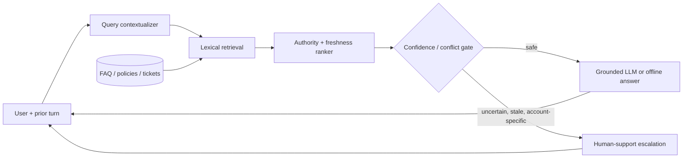

# LearnForge support assistant

A compact RAG prototype for the Applied AI/LLM Engineer take-home. It ingests the supplied Markdown corpus, retrieves individual FAQ/policy/ticket records, applies source-authority and recency weighting, carries forward the previous user question, and escalates uncertain or purchase-specific cases.

## Run

Python 3.11+ is the only requirement.

```bash
python app.py --question "Can I download a course on my laptop?"
python -m unittest -v
```

The default corpus directory is the supplied assignment location. For another location, set `KNOWLEDGE_BASE_DIR` or pass `--data-dir`.

To enable generation, set `OPENAI_API_KEY`; any OpenAI-compatible service works with `OPENAI_BASE_URL` and `LLM_MODEL`. Without a key, the app returns a source-backed excerpt, keeping the prototype runnable and auditable offline.

## Architecture



## Data schema

Each parsed record is a `Document`:

| Field | Purpose |
| --- | --- |
| `id`, `kind`, `title`, `text` | retrieval identity and content |
| `reviewed` | explicit policy recency where supplied |
| `stale_language` | ingestion signal for superseded material |
| `score`, `source` | retrieval metadata returned to the answer layer |

In production this maps directly to a vector-table record with `embedding`, `content_hash`, `source_uri`, `published_at`, `reviewed_at`, `authority`, and `superseded_by` added for change management.

## Failure handling

- Low retrieval score: do not answer; escalate.
- High-risk billing/refund language without an authoritative policy, or mixed with historical tickets: escalate for purchase-specific review.
- Stale/conflicting text: policies rank above FAQs and tickets; dated policy language is preserved as metadata. The system never treats a historical ticket as current policy.
- Bad retrieval / prompt injection: only retrieved source text is passed to the optional generator, with an explicit grounded-answer instruction. Answers display their sources.
- Account actions: this prototype never performs cancellations, refunds, or account changes; it routes them to a human workflow.

## Evaluation plan

Build a labeled set from the supplied questions plus adversarial variants: direct FAQ questions, policy conflicts, unsupported questions, account-specific claims, stale-help prompts, and multi-turn follow-ups. Track:

- grounded-answer correctness and citation precision;
- hallucination rate (claims unsupported by retrieved passages);
- retrieval recall@k for the expected authoritative source;
- escalation precision/recall for conflict and low-confidence cases;
- latency and the rate of unnecessary escalation.

Review errors by source type and publish the evaluation set with expected `answer` or `escalate` decisions.

## Trade-offs

This uses dependency-free lexical retrieval because the corpus is tiny, transparent, fast, and easy to run in a take-home environment. At scale, I would add hybrid dense + lexical retrieval, reranking, document versioning/tombstones, a real conversation store, offline evaluation, and observability. The deliberate choice is conservative escalation over plausible guesses: it trades coverage for lower policy and billing hallucination risk.
